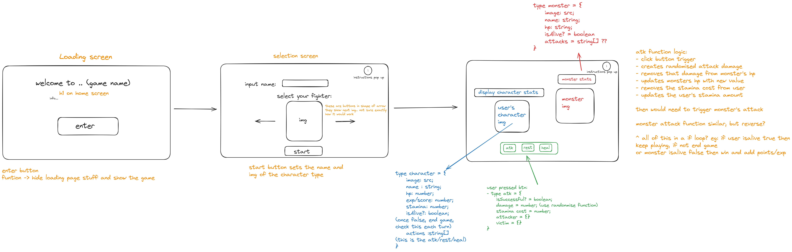

<h1 align="center">Realm of Inner Demons</h1>
<h3 align="center">A turn-based pixel game</h3>

### Project Outline

---

 In this project, the end goal was to create a functioning game using typescript, SCSS and HTML.

###  MVP

---

I started project by planning what sort of game I wanted, what the layout would be and any possible functionality and features of the game.

Here is a rough sketch, using Excalidraw, of my initial idea:

### How to play

---

 Head over to https://byasar3.github.io/ts-game/ to play the game! 

### 💻 Tech Stack :

---

- Vite
- TypeScript
- HTML
- SASS/SCSS

